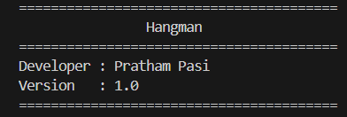
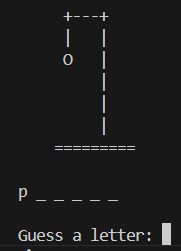
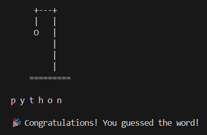
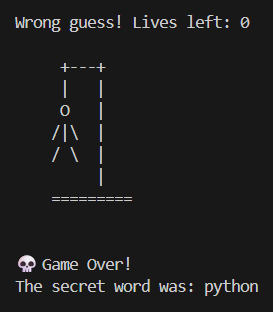
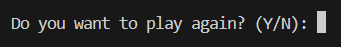

# 🎮 Hangman Game (Python)

A beginner-friendly command-line **Hangman Game** built using Python.

This project demonstrates Python fundamentals including functions, loops, lists, input validation, and clean code organization through a classic word-guessing game.

---

## 📖 About the Project

Hangman is a classic word-guessing game where the player tries to guess a randomly selected word one letter at a time.

Each incorrect guess reduces the player's remaining lives while the Hangman figure is gradually drawn. The game ends when the player guesses the complete word or runs out of lives.

---

## ✨ Features

- 🎲 Random word selection
- 🎨 ASCII Hangman drawing
- ✅ Input validation
- 🔁 Duplicate letter detection
- ❤️ Lives system
- 🏆 Win condition
- 💀 Lose condition
- 🔄 Play Again functionality
- 🧹 Clean and modular code using functions

---

## 🛠 Technologies Used

- Python 3
- Random Module

---

## 📚 Python Concepts Covered

- Variables
- Lists
- Functions
- Function Parameters
- Return Statement
- While Loops
- For Loops
- Conditional Statements
- Input Validation
- String Methods
- Random Module

---

## 📂 Project Structure

```text
hangman-game/
│
├── hangman.py
├── README.md
└── SS/
    ├── home-screen.png
    ├── gameplay.png
    ├── winning-game.png
    ├── losing-game.png
    └── play-again.png
```

---

## ▶️ How to Run

Clone the repository

```bash
git clone https://github.com/pratham133/hangman-game.git
```

Go to the project directory

```bash
cd hangman-game
```

Run the program

```bash
python hangman.py
```

---

# 📸 Project Screenshots

## 🏠 Home Screen



---

## 🎮 Gameplay



---

## 🏆 Winning the Game



---

## 💀 Game Over



---

## 🔄 Play Again



---

## 👨‍💻 Developer

**Pratham Pasi**

Learning Python for:

- Artificial Intelligence
- Data Analytics
- Software Engineering

---

⭐ If you found this project helpful, feel free to star the repository.